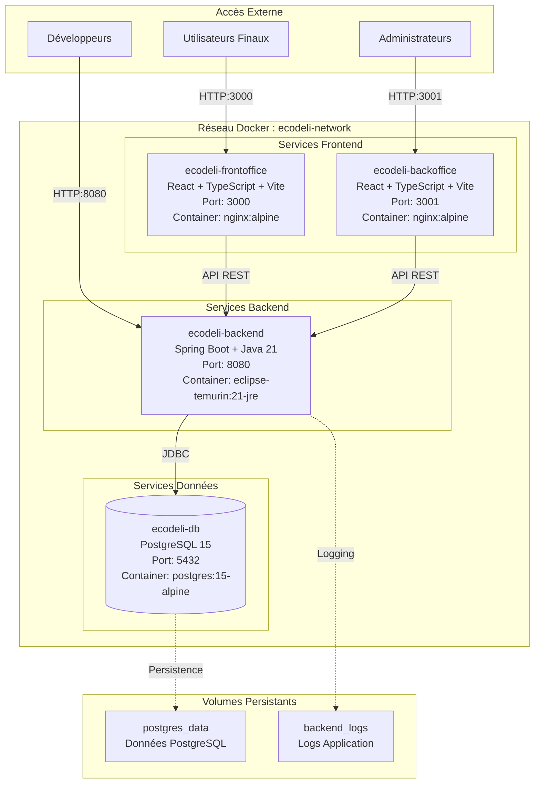

# ARCHITECTURE DOCKER - PROJET ECODELI

**Auteur :** Tom Georgin  
**Projet :** PA2 ESGI 2024-2025  
**Date :** Juin 2025  
**Sujet :** Conteneurisation des services du Projet Annuel

---

## I. INTRODUCTION

EcoDeli est une plateforme web de services écoresponsables développée dans le cadre du Projet Annuel 2024-2025 à l'ESGI. Cette application de gestion de services logistiques comprend un backoffice d'administration et un frontoffice pour les utilisateurs finaux (livreurs, clients, commerçants).

La conteneurisation de ce projet vise à standardiser les environnements de développement et production, simplifier le déploiement et permettre une évolution indépendante de chaque composant. L'approche retenue s'appuie sur une architecture microservices avec Docker, où chaque service majeur est isolé dans son propre conteneur pour une gestion optimale.

---

## II. ARCHITECTURE GÉNÉRALE

### 2.1 Vue d'ensemble

L'architecture conteneurisée d'EcoDeli s'articule autour de quatre services principaux orchestrés via Docker Compose :

### 2.2 Topologie réseau

L'architecture utilise un réseau Docker isolé (`ecodeli-network`) de type bridge permettant la communication inter-services tout en maintenant l'isolation par rapport à l'environnement hôte.

**Configuration réseau :**
- **Réseau interne** : `ecodeli-network` (172.20.0.0/16)
- **Exposition externe** : Ports mappés sélectivement
- **Communication inter-services** : Résolution DNS automatique par nom de service

### 2.3 Stratégie de volumes

Deux types de volumes assurent la persistance des données :

- **`postgres_data`** : Stockage des données métier de l'application
- **`backend_logs`** : Conservation des logs applicatifs pour monitoring et debugging

---

## III. DESCRIPTION DÉTAILLÉE DES SERVICES

### 3.1 Service de Base de Données (ecodeli-db)

**Rôle et responsabilités :**
Le service `ecodeli-db` constitue la couche de persistance de l'application EcoDeli. Il assure le stockage sécurisé et fiable de toutes les données métier : utilisateurs, annonces, transactions, et données de gestion.

**Technologies utilisées :**
- **Image de base** : `postgres:15-alpine`
- **Système de gestion de base de données** : PostgreSQL 15.x
- **Système d'exploitation** : Alpine Linux (optimisation de taille)

**Configuration technique :**
- **Port d'exposition** : 5432 (standard PostgreSQL)
- **Base de données** : `ecodeli_db`
- **Authentification** : Utilisateur/mot de passe sécurisé
- **Encodage** : UTF-8 avec locale C pour performances optimales
- **Volume persistant** : `/var/lib/postgresql/data`

**Particularités de l'implémentation :**
- Health check automatique via `pg_isready`
- Configuration d'initialisation personnalisée
- Logs séparés pour monitoring
- Stratégie de backup intégrée

### 3.2 Service Backend API (ecodeli-backend)

**Rôle dans l'architecture :**
Le service `ecodeli-backend` expose l'API REST centrale de l'application. Il implémente toute la logique métier, gère l'authentification/autorisation, et orchestre les interactions avec la base de données.

**Stack technique :**
- **Runtime** : Java 21 (Eclipse Temurin JRE)
- **Framework** : Spring Boot 3.4.4
- **ORM** : Spring Data JPA avec Hibernate
- **Sécurité** : Spring Security avec JWT
- **Build** : Maven 3.x

**Fonctionnalités exposées :**
- **Gestion des utilisateurs** : Inscription, authentification, profils
- **Gestion des annonces** : CRUD complet avec filtrage
- **Services de livraison** : Coordination livreurs/clients
- **Administration** : Endpoints de gestion pour le backoffice
- **Monitoring** : Endpoints Actuator pour supervision

**Architecture interne :**
- **Contrôleurs REST** : Exposition des APIs
- **Services métier** : Logique applicative
- **Repositories** : Accès aux données
- **DTOs** : Objets de transfert optimisés
- **Configuration** : Profiles Spring pour environnements

### 3.3 Service Frontend Frontoffice (ecodeli-frontoffice)

**Interface utilisateur finale :**
Le service `ecodeli-frontoffice` fournit l'interface web destinée aux utilisateurs finaux de la plateforme : clients cherchant des services de livraison, livreurs proposant leurs services, et commerçants gérant leurs annonces.

**Technologies :**
- **Framework** : React 19 avec hooks modernes
- **Langage** : TypeScript pour la sécurité de type
- **Build tool** : Vite pour performances optimales
- **Serveur web** : Nginx Alpine en production
- **Styling** : CSS moderne avec composants réutilisables

**Fonctionnalités utilisateur :**
- **Authentification** : Connexion/inscription sécurisée
- **Navigation** : Interface intuitive et responsive
- **Gestion des annonces** : Consultation et création
- **Profil utilisateur** : Gestion des informations personnelles
- **Tableau de bord** : Vue d'ensemble personnalisée

**Optimisations techniques :**
- **Code splitting** : Chargement progressif
- **Cache stratégique** : Amélioration des performances
- **PWA ready** : Support des applications progressives

### 3.4 Service Frontend Backoffice (ecodeli-backoffice)

**Interface d'administration :**
Le service `ecodeli-backoffice` propose une interface d'administration complète pour la gestion opérationnelle de la plateforme EcoDeli.

**Fonctionnalités de gestion :**
- **Dashboard administrateur** : Vue d'ensemble des métriques
- **Gestion des utilisateurs** : CRUD complet avec validation
- **Modération des annonces** : Validation et supervision
- **Gestion des livreurs** : Suivi et administration
- **Rapports et statistiques** : Analyse des données

**Sécurité et accès :**
- **Authentification renforcée** : Contrôle d'accès strict
- **Audit trail** : Traçabilité des actions administratives
- **Permissions granulaires** : Gestion des rôles
- **Protection CSRF** : Sécurisation des formulaires

**Technologies identiques au frontoffice :**
- React 19 + TypeScript + Vite
- Nginx pour la production
- Optimisations de performance adaptées

---

## IV. JUSTIFICATION DES CHOIX ARCHITECTURAUX

### 4.1 Choix de l'architecture microservices

**Séparation des responsabilités :**
L'adoption d'une architecture microservices permet une séparation claire des préoccupations. Chaque service a une responsabilité unique et bien définie :
- La base de données se concentre uniquement sur la persistance
- Le backend gère exclusivement la logique métier et les APIs
- Les frontends se spécialisent dans l'expérience utilisateur

Cette séparation facilite la maintenance, réduit les couplages et améliore la testabilité de chaque composant.

**Scalabilité indépendante :**
L'architecture microservices permet de faire évoluer chaque service selon ses besoins spécifiques :
- Le backend API peut être répliqué pour gérer une charge importante
- Les frontends peuvent être déployés sur des CDN pour améliorer les performances
- La base de données peut être optimisée indépendamment

**Maintenance facilitée :**
Chaque équipe de développement peut se concentrer sur son domaine d'expertise :
- Spécialistes backend pour l'API Java/Spring
- Experts frontend pour les interfaces React
- Administrateurs de base de données pour PostgreSQL

### 4.2 Avantages de Docker

**Isolation des environnements :**
Docker garantit que chaque service s'exécute dans un environnement isolé et reproductible. Les dépendances, versions de runtime et configurations sont encapsulées, éliminant les problèmes de compatibilité.

**Reproductibilité des déploiements :**
Les conteneurs Docker assurent que l'application fonctionne de manière identique en développement, test et production. Cette reproductibilité réduit considérablement les risques liés aux déploiements.

**Gestion des dépendances :**
Chaque service embarque ses propres dépendances, éliminant les conflits de versions et simplifiant la gestion des environnements.

**Optimisation des ressources :**
Les conteneurs partagent le noyau de l'OS hôte, offrant de meilleures performances que la virtualisation traditionnelle tout en maintenant l'isolation.

### 4.3 Bénéfices pour l'application EcoDeli

**Facilité de déploiement :**
Le déploiement d'EcoDeli se résume à une seule commande Docker Compose, transformant un processus complexe en une opération simple et fiable.

**Environnements de développement standardisés :**
Tous les développeurs travaillent avec exactement la même configuration, éliminant les problèmes de compatibilité et accélérant l'onboarding.

**Évolutivité technique :**
L'architecture conteneurisée facilite l'ajout de nouveaux services (notifications, paiements, analytics) sans impacter l'existant.

**Réduction des coûts opérationnels :**
- Diminution du temps de déploiement
- Réduction des incidents liés aux environnements
- Facilitation de la maintenance et du monitoring

---

## V. IMPLÉMENTATION TECHNIQUE

### 5.1 Configuration Docker Compose

L'orchestration des services s'appuie sur Docker Compose avec deux configurations distinctes :

**Environnement de développement (`docker-compose.dev.yml`) :**
- Hot reload activé pour les services frontend
- Base de données exposée pour accès direct
- Logs détaillés pour debugging
- Volumes de code montés pour développement

**Environnement de production (`docker-compose.prod.yml`) :**
- Images optimisées pour la production
- Sécurité renforcée (utilisateurs non-root)
- Limitations de ressources
- Base de données non exposée

### 5.2 Gestion des réseaux

**Réseau isolé :**
Un réseau Docker bridge dédié (`ecodeli-network`) assure la communication inter-services tout en maintenant l'isolation.

**Résolution DNS :**
Les services se découvrent automatiquement par nom, facilitant la configuration et la maintenance.

**Segmentation :**
Possibilité d'implémenter plusieurs réseaux pour séparer les couches (frontend, backend, données).

### 5.3 Stratégie de volumes

**Persistance des données :**
- Volume nommé pour PostgreSQL garantissant la persistance
- Volume dédié pour les logs applicatifs
- Stratégie de backup intégrée

**Performance :**
- Volumes optimisés pour les performances en lecture/écriture
- Séparation des données temporaires et persistantes

### 5.4 Sécurité et bonnes pratiques

**Utilisateurs non-root :**
Tous les conteneurs s'exécutent avec des utilisateurs dédiés non-privilégiés.

**Images minimales :**
Utilisation d'images Alpine pour réduire la surface d'attaque et optimiser les performances.

**Secrets management :**
Variables d'environnement externalisées pour une gestion sécurisée des secrets.

**Health checks :**
Surveillance automatique de l'état des services avec redémarrage automatique en cas de défaillance.

---

## VI. DÉPLOIEMENT ET ORCHESTRATION

### 6.1 Environnements de développement et production

**Développement :**
- Configuration optimisée pour la productivité des développeurs
- Hot reload et rechargement automatique
- Accès direct aux bases de données pour debugging
- Logs verbeux pour traçabilité

**Production :**
- Configuration optimisée pour les performances et la sécurité
- Images minimales et optimisées
- Monitoring et alerting intégrés
- Stratégies de backup automatisées

### 6.2 Processus de build multi-étapes

**Backend (Spring Boot) :**
1. **Étape BUILD** : Compilation Maven avec toutes les dépendances
2. **Étape RUNTIME** : Image JRE minimal avec uniquement l'artifact final

**Frontend (React/Vite) :**
1. **Étape BUILD** : Compilation TypeScript et bundling Vite
2. **Étape RUNTIME** : Serveur Nginx avec fichiers statiques optimisés

**Avantages :**
- Réduction de 70% de la taille des images finales
- Séparation claire entre environnements de build et runtime
- Sécurité renforcée (pas d'outils de développement en production)

### 6.3 Monitoring et health checks

**Surveillance automatique :**
- Health checks configurés pour chaque service
- Détection automatique des défaillances
- Redémarrage intelligent des conteneurs défaillants

**Métriques et logs :**
- Centralisation des logs applicatifs
- Métriques de performance intégrées
- Préparation pour intégration avec solutions de monitoring externes

---

## VII. CONCLUSION

### 7.1 Synthèse des bénéfices apportés

La conteneurisation du projet EcoDeli avec Docker apporte des bénéfices significatifs à multiple niveaux :

**Technique :**
- Standardisation complète des environnements
- Simplification drastique du processus de déploiement
- Amélioration de la fiabilité et de la reproductibilité
- Optimisation des performances et des ressources

**Opérationnel :**
- Réduction des temps de mise en production
- Diminution des incidents liés aux environnements
- Facilitation de la maintenance et des mises à jour
- Amélioration de la collaboration entre équipes

**Business :**
- Accélération du time-to-market
- Réduction des coûts opérationnels
- Amélioration de la qualité de service
- Facilitation de la scalabilité