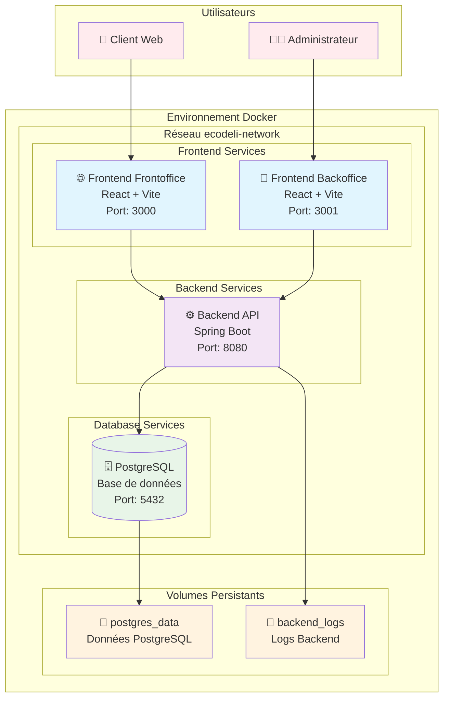

# Architecture Docker - EcoDeli

## Diagramme d'Architecture

## Description des Services

### 1. 🌐 Frontend Frontoffice
- **Technologie** : React 18 + Vite + TypeScript
- **Rôle** : Interface utilisateur pour les clients EcoDeli
- **Port** : 3000 (développement), 80 (production)
- **Image** : Multi-étapes (build → development/production)
- **Fonctionnalités** : 
  - Consultation des annonces
  - Inscription/connexion utilisateurs
  - Système de vérification email

### 2. 🔐 Frontend Backoffice
- **Technologie** : React 18 + Vite + TypeScript
- **Rôle** : Interface d'administration pour la gestion EcoDeli
- **Port** : 3001 (développement), 80 (production)
- **Image** : Multi-étapes (build → development/production)
- **Fonctionnalités** :
  - Gestion des utilisateurs
  - Administration des annonces
  - Tableau de bord analytique

### 3. ⚙️ Backend API
- **Technologie** : Spring Boot 3.4.4 + Java 21
- **Rôle** : API REST pour la logique métier EcoDeli
- **Port** : 8080
- **Image** : Multi-étapes (build → runtime/production)
- **Fonctionnalités** :
  - Authentification JWT
  - Gestion des utilisateurs (Client, Livreur, Commerçant)
  - Service email avec vérification
  - API RESTful complète

### 4. 🗄️ Base de Données PostgreSQL
- **Technologie** : PostgreSQL 15 Alpine
- **Rôle** : Persistance des données EcoDeli
- **Port** : 5432 (interne), 5433 (externe développement)
- **Image** : Officielle PostgreSQL
- **Données** :
  - Utilisateurs et profils
  - Annonces et livraisons
  - Codes de vérification email

## Justification des Choix Architecturaux

### Conteneurisation avec Docker
- **Isolation** : Chaque service s'exécute dans son propre environnement
- **Reproductibilité** : Environnements identiques dev/prod
- **Scalabilité** : Services indépendants facilement scalables
- **Déploiement** : Déploiement simplifié et automatisable

### Architecture Multi-Services
- **Séparation des responsabilités** : Frontend/Backend/Database isolés
- **Maintenance** : Chaque service peut être maintenu indépendamment
- **Sécurité** : Isolation réseau et contrôle d'accès granulaire

### Builds Multi-Étapes
- **Optimisation** : Images de production minimalistes
- **Sécurité** : Pas d'outils de développement en production
- **Performance** : Images plus petites, déploiement plus rapide

### Orchestration Docker Compose
- **Simplicité** : Configuration déclarative des services
- **Environnements** : Configurations distinctes dev/prod
- **Dépendances** : Gestion automatique des dépendances entre services

## Avantages de cette Architecture

1. **Développement Local Simplifié**
   - `docker-compose -f docker-compose.dev.yml up` démarre tout l'environnement
   - Hot reload pour le développement frontend
   - Volumes pour persister les données

2. **Production Optimisée**
   - Images minimalistes et sécurisées
   - Configuration optimisée pour les performances
   - Redémarrage automatique des services

3. **Sécurité Renforcée**
   - Utilisateurs non-root dans les containers
   - Variables d'environnement pour les secrets
   - Isolation réseau entre les services

4. **Portabilité Maximale**
   - Fonctionne sur n'importe quel système avec Docker
   - Configuration centralisée via `.env`
   - Documentation complète pour l'équipe

## Réseaux et Volumes

### Réseaux Docker
- **ecodeli-network** (dev) : Communication entre services en développement
- **ecodeli-network-prod** (prod) : Communication sécurisée en production

### Volumes Persistants
- **postgres_data** : Données PostgreSQL persistantes
- **backend_logs** : Logs du backend Spring Boot
- Séparés entre dev et prod pour l'isolation

Cette architecture respecte les bonnes pratiques Docker et assure une séparation claire des responsabilités tout en maintenant la simplicité d'utilisation.
