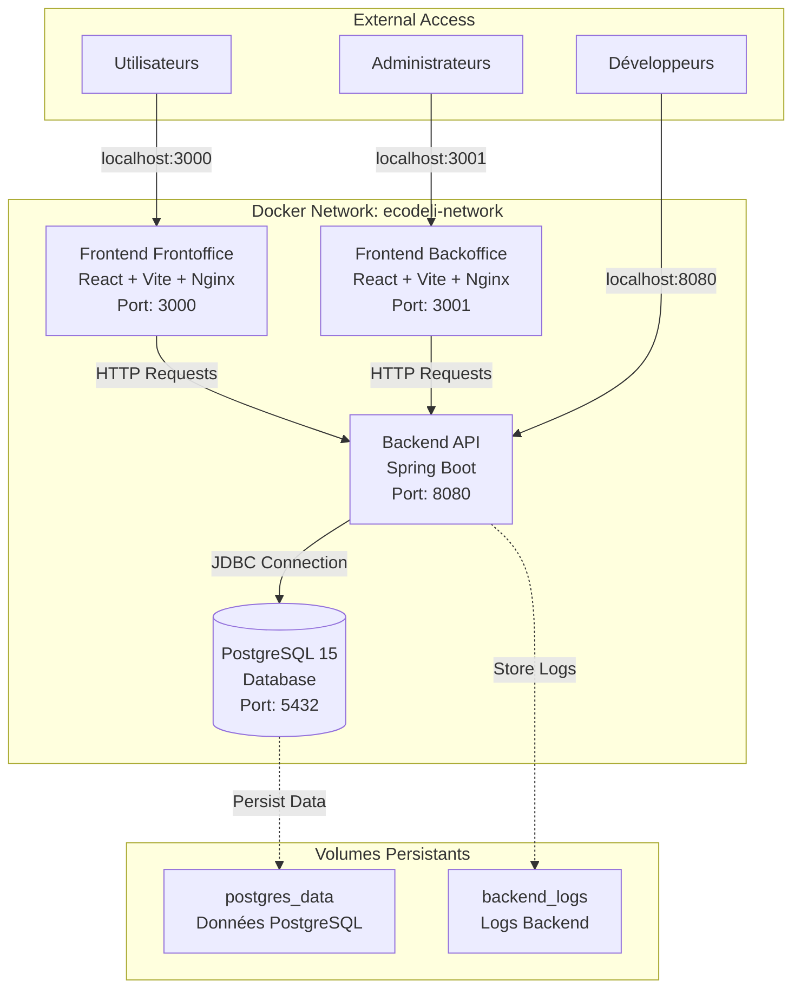

# 🐳 EcoDeli - Documentation Docker

## 📋 Table des matières

1. [Architecture des Services](#architecture-des-services)
2. [Prérequis](#prérequis)
3. [Installation et Configuration](#installation-et-configuration)
4. [Lancement des Services](#lancement-des-services)
5. [Gestion des Environnements](#gestion-des-environnements)
6. [Monitoring et Maintenance](#monitoring-et-maintenance)
7. [Dépannage](#dépannage)
8. [Architecture Docker](#architecture-docker)

---

## 🏗️ Architecture des Services

### Diagramme d'architecture



### Services conteneurisés

| Service | Technologie | Port | Description |
|---------|-------------|------|-------------|
| **ecodeli-db** | PostgreSQL 15 Alpine | 5432 | Base de données principale |
| **ecodeli-backend** | Spring Boot + Java 21 | 8080 | API REST avec JPA/Hibernate |
| **ecodeli-frontoffice** | React + Vite + Nginx | 3000 | Interface utilisateur |
| **ecodeli-backoffice** | React + Vite + Nginx | 3001 | Interface d'administration |

---

## 🔧 Prérequis

### Logiciels requis

- **Docker** >= 24.0
- **Docker Compose** >= 2.0
- **Git** (pour cloner le projet)

### Vérification de l'installation

```bash
# Vérifier Docker
docker --version
docker compose version

# Vérifier l'état de Docker
docker info
```

---

## 📦 Installation et Configuration

### 1. Clonage du projet

```bash
git clone <url-du-projet>
cd PA2
```

### 2. Configuration des variables d'environnement

```bash
# Copier le fichier template
cp .env.example .env

# Éditer les variables selon votre environnement
nano .env  # ou votre éditeur préféré
```

### Variables importantes à modifier :

```env
# Sécurité - OBLIGATOIRE en production
POSTGRES_PASSWORD=votre_mot_de_passe_securise
JWT_SECRET=votre_cle_jwt_unique_et_complexe

# Ports (optionnel)
BACKEND_PORT=8080
FRONTOFFICE_PORT=3000
BACKOFFICE_PORT=3001
```

### 3. Création des répertoires de volumes

```bash
mkdir -p docker-volumes/postgres-logs
mkdir -p docker-volumes/backend-logs
```

---

## 🚀 Lancement des Services

### Développement

```bash
# Lancement complet (avec logs)
docker compose -f docker-compose.dev.yml up

# Lancement en arrière-plan
docker compose -f docker-compose.dev.yml up -d

# Reconstruction des images
docker compose -f docker-compose.dev.yml up --build

# Lancement d'un service spécifique
docker compose -f docker-compose.dev.yml up ecodeli-backend
```

### Production

```bash
# Lancement en production
docker compose -f docker-compose.prod.yml up -d

# Vérification du statut
docker compose -f docker-compose.prod.yml ps

# Visualisation des logs
docker compose -f docker-compose.prod.yml logs -f
```

### Arrêt des services

```bash
# Arrêt propre
docker compose -f docker-compose.dev.yml down

# Arrêt avec suppression des volumes (ATTENTION : perte de données)
docker compose -f docker-compose.dev.yml down -v
```

---

## 🌍 Gestion des Environnements

### Environnement de Développement

**Caractéristiques :**
- Hot reload activé pour les frontends
- Logs détaillés activés
- Base de données exposée sur le port 5432
- Mode debug Spring Boot

**URLs d'accès :**
- Frontend Frontoffice : http://localhost:3000
- Frontend Backoffice : http://localhost:3001
- API Backend : http://localhost:8080
- Base de données : localhost:5432

### Environnement de Production

**Caractéristiques :**
- Images optimisées (nginx pour les frontends)
- Logs limités aux erreurs
- Base de données non exposée
- Sécurité renforcée (utilisateurs non-root)
- Limitations de ressources

**Optimisations de sécurité :**
- Conteneurs en lecture seule
- Utilisateurs non-root
- Pas de nouveaux privilèges
- Réseaux isolés

---

## 📊 Monitoring et Maintenance

### Commandes utiles

```bash
# Statut des conteneurs
docker compose -f docker-compose.dev.yml ps

# Logs d'un service spécifique
docker compose -f docker-compose.dev.yml logs -f ecodeli-backend

# Statistiques des conteneurs
docker stats

# Inspection d'un conteneur
docker inspect ecodeli-backend-dev

# Exécution de commandes dans un conteneur
docker exec -it ecodeli-backend-dev bash
```

### Health checks

Tous les services disposent de health checks automatiques :

```bash
# Vérifier la santé des services
docker compose -f docker-compose.dev.yml ps

# Statut : healthy/unhealthy/starting
```

### Sauvegarde des données

```bash
# Sauvegarde de la base de données
docker exec ecodeli-db-dev pg_dump -U postgres ecodeli_db > backup.sql

# Restauration
cat backup.sql | docker exec -i ecodeli-db-dev psql -U postgres ecodeli_db
```

---

## 🔍 Dépannage

### Problèmes courants

#### 1. Port déjà utilisé

```bash
# Identifier le processus utilisant le port
netstat -tulpn | grep :8080

# Changer le port dans .env
BACKEND_PORT=8081
```

#### 2. Problème de connexion à la base de données

```bash
# Vérifier que la DB est démarrée
docker compose -f docker-compose.dev.yml logs ecodeli-db

# Tester la connexion
docker exec -it ecodeli-db-dev psql -U postgres -d ecodeli_db
```

#### 3. Erreur de build

```bash
# Nettoyer les images et reconstruire
docker system prune -a
docker compose -f docker-compose.dev.yml build --no-cache
```

#### 4. Problème de permissions

```bash
# Vérifier les permissions des volumes
ls -la docker-volumes/
sudo chown -R $USER:$USER docker-volumes/
```

### Logs de débogage

```bash
# Logs détaillés pour tous les services
docker compose -f docker-compose.dev.yml logs --follow

# Logs d'un service avec timestamp
docker compose -f docker-compose.dev.yml logs -f -t ecodeli-backend
```

---

## 🏛️ Architecture Docker

### Builds multi-étapes

Chaque Dockerfile utilise des builds multi-étapes pour :
- **Étape BUILD** : Compilation du code (Maven/NPM)
- **Étape RUNTIME** : Exécution optimisée (JRE/Nginx)

**Avantages :**
- Images finales plus légères
- Séparation des dépendances de build/runtime
- Sécurité renforcée

### Réseaux Docker

```bash
# Réseau isolé pour tous les services
docker network ls | grep ecodeli

# Inspection du réseau
docker network inspect ecodeli-network
```

### Volumes persistants

```bash
# Lister les volumes
docker volume ls | grep ecodeli

# Inspecter un volume
docker volume inspect ecodeli_postgres_data
```

---

## 📋 Commandes de référence rapide

```bash
# Développement - Démarrage rapide
docker compose -f docker-compose.dev.yml up -d

# Production - Déploiement
docker compose -f docker-compose.prod.yml up -d

# Arrêt des services
docker compose -f docker-compose.dev.yml down

# Rebuild complet
docker compose -f docker-compose.dev.yml up --build --force-recreate

# Nettoyage complet
docker system prune -a --volumes
```

---

## 🆘 Support

En cas de problème, vérifiez :
1. Les logs des conteneurs : `docker compose logs`
2. L'état des services : `docker compose ps`
3. Les variables d'environnement : `cat .env`
4. Les ressources système : `docker stats`

**Auteur :** Tom Georgin  
**Projet :** EcoDeli - PA2 ESGI 2024-2025
